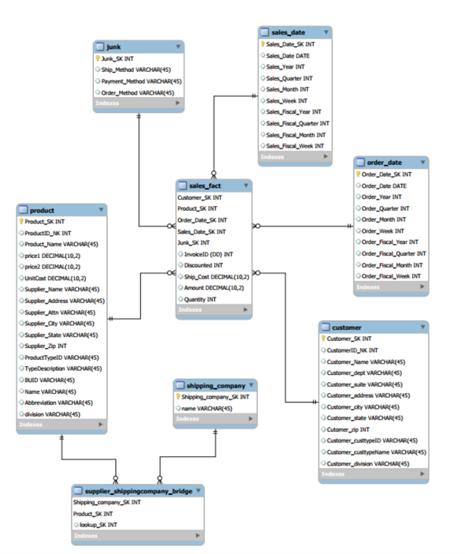

# Data Warehouse - The Product Company
Course work for Data warehousing class

I. Data Mart Design Definition
   1. Universe of Discourse
   2. Information Package

II. Dimensional Model

III. Data Staging: ETL – Data Extract File Definitions 

IV. Data Staging: ETL – Source-to-Target Mappings 

V. SQL Code – Tables & Constraints

VI. Data Staging Activities - ETL
   1. Data Cleansing
   2. Data Transformation Table Population

VII. End User Applications
   1. Queries
   2. A View

VIII. Handling Slowly Changing Dimensions (SCD)

IX. Many-to-Many (N-M) Relationship Implementation Option

_Data Mart_
